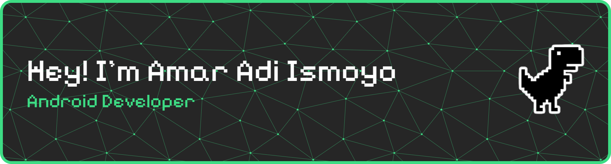

  
  

---

### 🛠️ Tech Stack & Tools

**Core Android Ecosystem** 

<!--postman, firebase,-->
**Architecture & Concepts** 

<!---->

**Libraries & Databases**  

<!---->

**Also Familiar With**  

<!--spring,mysql,mongodb,-->
---

### 📊 GitHub Stats

  
  
  <!--  -->

---

  <i>"Kuda kuda apa yang berputar-putar? Kuda looping. Aaxixixixi..."</i>

